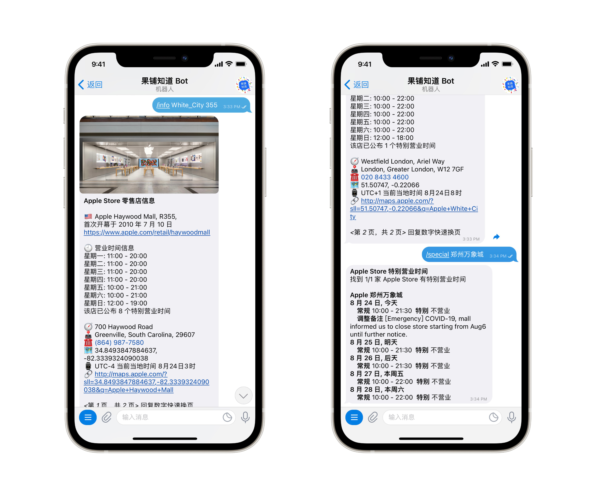

### asaDuplex

**一个完全关于 Apple Store 的 Repository。** — Junyi

果铺知道通过以下代码获得了许多关于 Apple Store 零售店的信息，

你可以在[微博](https://weibo.com/arsteller)和 [Telegram Channel](https://t.me/guopuzd) 关注果铺知道以直接接收以下代码的运行结果。

\-

### 大事记

2019 年 8 月：所有代码要求使用 Python 3，不向下兼容 Python 2。

2019 年 11 月：停止通过 while True 和 time.sleep 实行占用内存的持久运行，改为一次执行代码，推荐配合 crontab 等计划任务命令使用。代码中引入了 logging 来保存代码的运行 log。

2020 年 11 月：停止通过 IFTTT Webhooks 将代码结果发至 iOS 用户，改为使用 Telegram Bot 推送结果，同时也支持了在发送的内容中应用 Markdown 文本样式、按钮、链接等。

2021 年 2 月：将 specialHours、Rtlimages 变得更加模块化，使数据获取和数据处理分析分开，方便其他代码可以利用相同的数据实现其他的功能。

2021 年 3 月：利用 asaDuplex 中的部分代码，推出果铺知道 Telegram Bot，方便用户快速查询 Apple Store 零售店信息及特别营业时间信息。

2021 年 8 月：进一步模块化代码，并将代码结果推送剥离，不再依赖 Telegram Bot 做结果推送。



\* asaDuplex 尚不开源 Telegram Bot 的运行代码。

**在所有代码的顶部，可能包含类似如下代码：**

```python
froom sdk_aliyun import post
from bot import tokens
```

这是我个人对结果推送的实现方式，`sdk_aliyun` 和 `bot` 并未在此库中给出。

可以看到，代码运行到输出阶段会产生一个包含文本、图片、链接等内容的字典，您可以通过编写适合您自己的推送结果的方式以获取代码结果，例如将内容推送至 Telegram Channel、微信公众号、其他第三方 iOS 推送 app 等。

 \-

### 代码

* allStoresInfoLite.py: 取得 Apple Store 零售店服务器信息
* Recruitment.py: 取得全球 Specialist 招聘情况以获得未来新店
* Rtl.py: 取得 Apple Store 零售店服务器图片更新
* Hours.py: 取得 Apple Store 特别营业时间信息
* Today.py: 取得最新 Today at Apple 活动
* Sitemap.py: 作为 Today.py 的补充，通过 sitemap.xml 取得额外的 Today at Apple 活动

### 数据获取模块

* storeInfo.py

  * 是一个非常强大的模块，其本质是通过分析 storeInfo.json 来处理 Apple Store 零售店信息
  * 通过 StoreID、StoreName、StoreNation 实现模糊搜索零售店
  * 通过 storeDict 从 Apple 官网获得零售店的基本数据
  * 通过 storePairs、storeReturn 实现自动拆分和解析不固定格式的零售店输入
  * 通过 DieterInfo 和 DieterHeader 返回零售店图片标头
* special.py
  * 自动解析 apple.com 源代码中提供的零售店常规营业时间安排和特别营业时间
  * 可尝试从 Apple 官网获得零售店特别营业时间的内部批注信息
  * 已完全适配了新版 Apple 零售店页面 HTML 代码
* constants.py
  * 为一些常量或较为啰嗦的需要在许多代码中反复用到的函数
  * 可能包括果铺知道 Bot 其他代码用到的数据
  * 提供一个简易的 Markdown 转换函数


### 数据文本

* savedEvent.txt、savedSitemap: 由 Today.py 或 Sitemap.py 生成的，已经检测到并保存的 Today at Apple 活动列表
* savedJobs.txt: 由 Recruitment.py 生成的，已经在检测到招聘的零售店编号
* storeInfo.json: 全球 Apple Store 名称（包含部分曾用名、ASCII 兼容名等以便于更广的匹配）、店号、国家或地区旗帜、开店时间、官网图片最后修改时间、URL slug、全球各国地区零售店按行政区划拆分、用于模糊搜索的关键字 alias 等
* storeList.json 和 storeList-format.json: 由 allStoresInfoLite.py 获得的零售店详细信息

### ~~已移除的代码~~

* inStock.py: 根据产品部件号码查寻指定产品在指定零售店的库存情况，为避免滥用移除
* onlineCrawl.py: 通过访问 Apple 官网以寻找新上架的产品部件号码，为避免滥用移除
* IFTTT.py: 起初为了 IFTTT Webhooks 推送创建的辅助程序，现已不再需要

\-

###### 底注

免责声明：

果铺知道是完全个人性质的微博账户和 Telegram Channel，果铺知道不受美国苹果公司授权、许可或赞助。以上代码中的数据，包括但不限于 storeInfo.json、storeList.json，均来自公开的 Apple 官方网站及其其它服务器。未经特别注明内容均有其版权。未经特别授权，所涉及到的任何文本、图片应仅作个人兴趣用途。有关更多 Apple 商标和内容使用细则，请参见 Apple Legal 及其 Intellectual Property 页面。

Disclaimer:

果铺知道, or 'Guo Pu Zhi Dao' is a completely personal-background Weibo Account and Telegram Channel. Guo Pu Zhi Dao is in no way authorized, approved, or endorsed by Apple, Inc. All data used in the code, including but not limited to 'storeInfo.json', 'storeList.json', were from Apple's official websites or its other public servers. Unless otherwise indicated, all materials are copyrighted. No part, unless explicit authorization, either text or images may be used for any purpose other than personal interests. For further information about policies on using Apple's trademarks and contents, please visit Apple Legal and its Intellectual Property webpages.